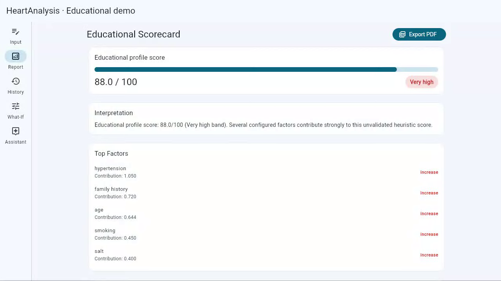

# HeartAnalysis

An educational Flutter and Flask product for exploring how a transparent, hand-coded heuristic responds to synthetic stroke-profile inputs.

> **Portfolio prototype — not medical software.** The 0–100 result is uncalibrated, was not trained or clinically validated on a patient cohort, and is not a disease probability, diagnosis, prognosis, or treatment recommendation. Use synthetic data only.

[](https://jashwanth-portfolio-ten.vercel.app/work/heart-analysis/)

[Open MP4](https://jashwanth-portfolio-ten.vercel.app/media/heart-analysis/demo.mp4) · [Download WebM](https://jashwanth-portfolio-ten.vercel.app/media/heart-analysis/demo.webm) · [Captions](https://jashwanth-portfolio-ten.vercel.app/media/heart-analysis/demo-captions.vtt)

## The showcase workflow

1. Load the deterministic synthetic profile.
2. Generate an explainable educational scorecard.
3. Inspect contributing factors and general educational guidance.
4. Change one factor in the What-If simulator and compare score movement.
5. Review local synthetic history and ask the rules-based assistant a bounded question.

The rules provider is the default and requires no model or provider credentials. Prediction persistence is off by default because the prototype has no user authentication; the demo launcher enables it only for an isolated local synthetic-data session.

## Verified product surface

- Flutter web/mobile/desktop client with responsive rail and bottom navigation.
- Flask API with Pydantic validation, deterministic scoring, model card, what-if simulation, history, and bounded assistant routes.
- Explainability through factor contributions and explicit score metadata.
- SQLite for isolated local demos and optional MySQL configuration.
- One-click synthetic example, PDF scorecard export, browser workflow verification, and mobile overflow coverage.
- Rules-first assistant with optional llama.cpp or OpenAI-compatible adapters; neither external provider is required or claimed in the release.

## Quick start

Prerequisites: Python 3.11+, Flutter stable, Node 24+, and Chromium support.

```powershell
cd backend
python -m venv .venv
.\.venv\Scripts\python -m pip install -r requirements-dev.txt
cd ..\frontend
flutter pub get
cd ..
.\scripts\run-demo.ps1
```

Open the web-server URL printed by Flutter, select **Load synthetic example**, and complete the five-tab workflow. The launcher uses `AI_PROVIDER=rules` and enables persistence only in the local demo process.

## API contract

| Route | Purpose |
| --- | --- |
| `GET /healthz` | Liveness evidence |
| `GET /v1/model-card` | Heuristic provenance, intended use, limitations, and validation status |
| `POST /v1/predict` | Educational scorecard from a validated synthetic profile |
| `POST /v1/simulate` | Deterministic input-change comparison |
| `POST /v1/ai/plan` | Structured rules-first educational plan |
| `POST /v1/ai/chat` | Bounded educational assistant response |
| `GET /v1/predictions` | Local synthetic history when persistence is explicitly enabled |

`risk_probability` remains the backward-compatible API field name. Its value is an uncalibrated heuristic score normalized to 0–1; `score_metadata.medical_probability` is always `false`.

## Verification

```powershell
cd backend
.\.venv\Scripts\python -m ruff check app tests
.\.venv\Scripts\python -m pytest -q
.\.venv\Scripts\python -m pip_audit -r requirements.txt

cd ..\frontend
flutter analyze --no-fatal-infos
flutter test
flutter build web --release --dart-define=API_BASE_URL=http://127.0.0.1:8000

cd ..
npm audit --audit-level=moderate
npm run test:demo
```

See [test evidence](docs/TEST_REPORT.md), [architecture](docs/ARCHITECTURE.md), [case study](docs/CASE_STUDY.md), [security policy](SECURITY.md), and [limitations](docs/LIMITATIONS.md).

## Deployment status

No public application deployment is claimed. GitHub Pages deployment is manual and requires `FRONTEND_API_BASE_URL`; the Render blueprint has automatic deployment disabled. A public release requires credential rotation, an explicit data-retention decision, authentication/tenant isolation for retained records, and provider-console review.

## Repository layout

`backend/` and `frontend/` are the canonical product packages. The older root-level Flutter/Python files are retained as historical source and are not CI, demo, or deployment targets.

## Release evidence

- Status: v1.0.0
- Data boundary: deterministic synthetic profile only
- Browser: Playwright bundled Chromium
- Walkthrough requirement: minimum three minutes with narration, captions, thumbnail, checksum, and inspected milestone frames

## License and use

No license is inferred. This repository is a portfolio demonstration and provides no medical, production, availability, privacy, or support warranty.
