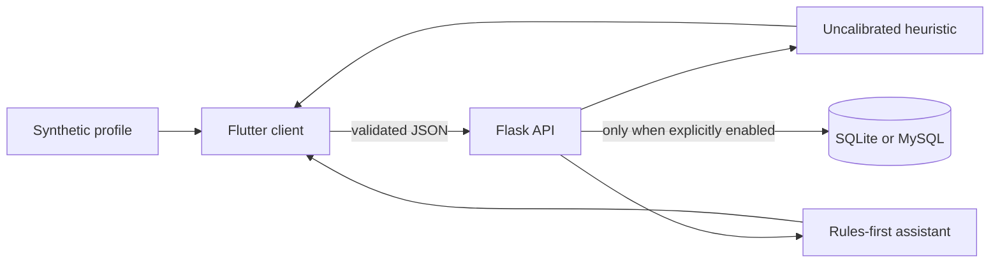

# Architecture

HeartAnalysis is a two-process educational product. `frontend/` is the canonical Flutter client and `backend/` is the canonical Flask API.

## Boundaries

- The heuristic is deterministic hand-written code, not a trained or calibrated medical model.
- `score_metadata.medical_probability=false` is returned with every score.
- `AI_PROVIDER=rules` is deterministic and network-free. llama.cpp and OpenAI-compatible adapters are optional, unverified release boundaries.
- `PERSIST_PREDICTIONS=false` is the default. The local demo opts in for synthetic history.
- The API has no end-user authentication or tenant isolation, so public persistence is outside the release boundary.
- The older root-level Flutter and Python sources are historical and are not CI, demo, or deployment targets.

## Failure behavior

Pydantic rejects malformed inputs with field-level errors. AI provider failures fall back to rules. Requests have size and AI-rate limits. Production rejects default secrets and wildcard CORS. External-provider and database failures must never be presented as successful.
