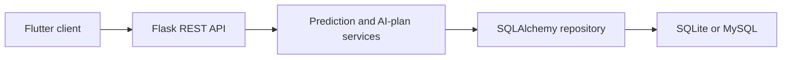

# HeartAnalysis architecture

Flutter client and Flask API for educational heart-risk estimation, history, explanations, and local or MySQL persistence.

## System view

## Component boundaries

- **Flutter client:** initiates the primary workflow.
- **Flask REST API:** owns one stage of the request or interaction flow.
- **Prediction and AI-plan services:** owns one stage of the request or interaction flow.
- **SQLAlchemy repository:** owns one stage of the request or interaction flow.
- **SQLite or MySQL:** provides the terminal integration or persistence boundary.

## Runtime and trust boundaries

This is an educational prototype, not medical advice. The repository contains two Flutter package trees that must be checked independently. Inputs crossing a network, filesystem, provider, or database boundary should be validated and logged without sensitive values. Optional integrations must fail clearly rather than being presented as successful.

## Technology

Flutter/Dart, Flask, Pydantic, SQLAlchemy, Alembic, SQLite/MySQL.

